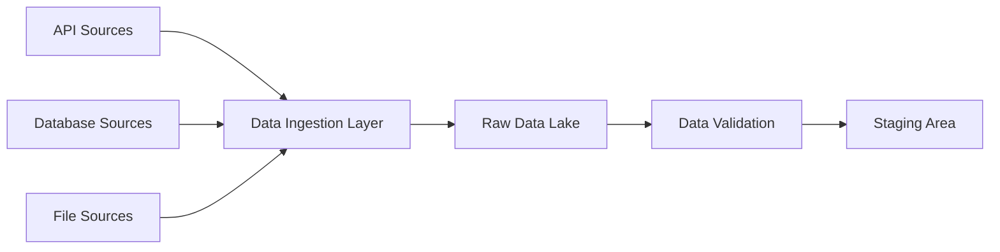
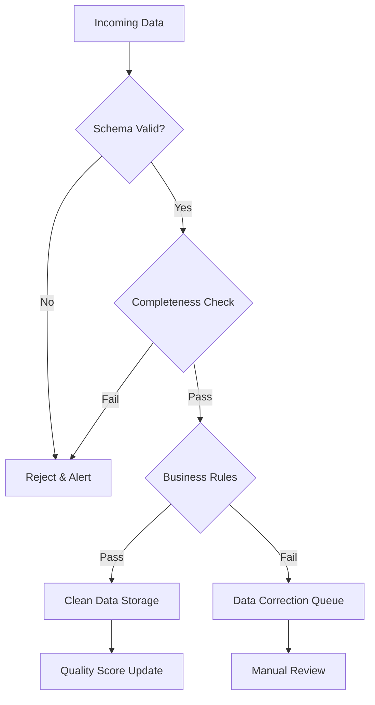
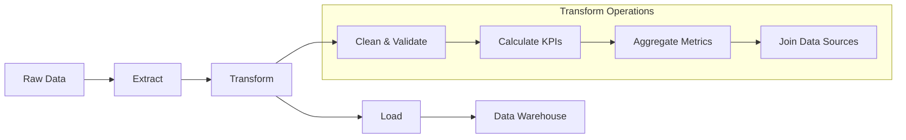
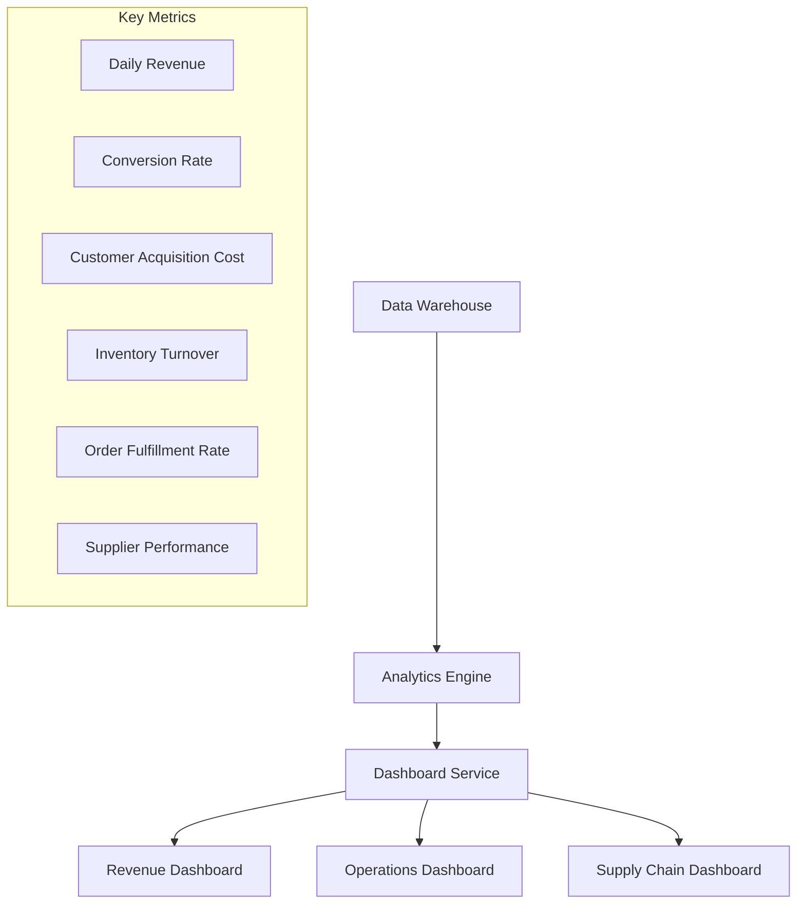
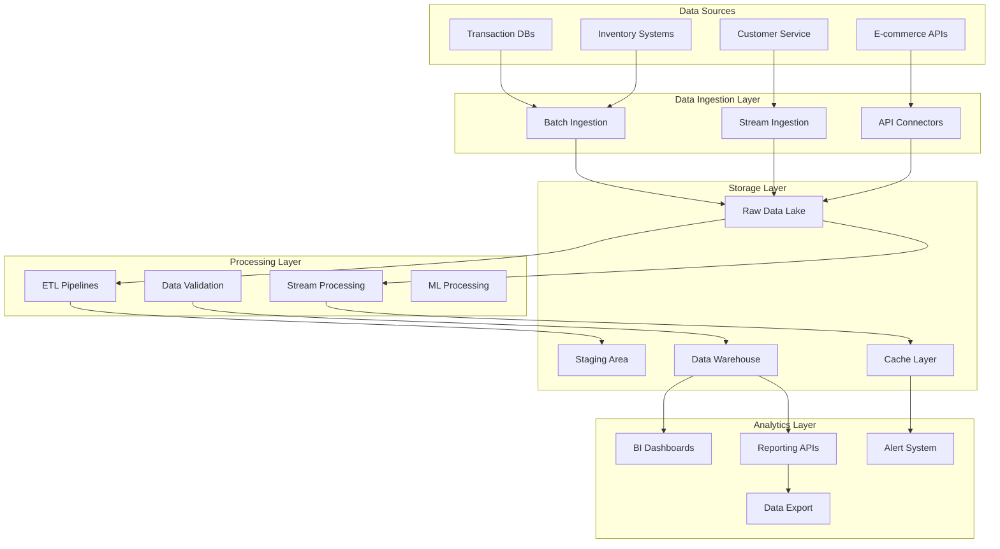
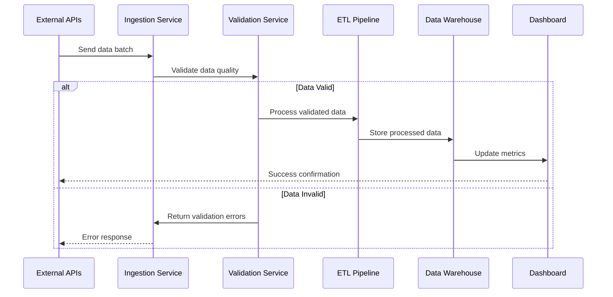
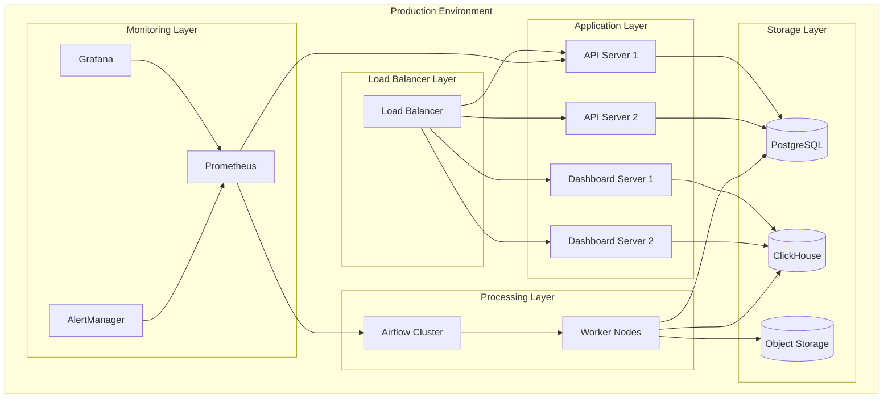

# E-commerce Data Platform - Product Requirements Document

## 1. Executive Summary

### Vision
Build a flexible, scalable data engineering platform that transforms raw e-commerce data into actionable business insights through modern ETL pipelines, real-time analytics, and comprehensive dashboards.

### Success Criteria
- **Technical Excellence**: Demonstrate proficiency in Python data engineering, ETL development, and modern analytics tools
- **Business Impact**: Enable data-driven decision making across operations, sales, and supply chain
- **Platform Flexibility**: Modular architecture that adapts to different company requirements without major refactoring
- **Portfolio Value**: Showcase enterprise-level data engineering capabilities for career advancement

### Key Outcomes
- Automated data pipelines processing multiple data sources
- Real-time dashboards for business operations monitoring
- Scalable architecture supporting growth from startup to enterprise scale
- Comprehensive data quality and governance framework

## 2. Problem Statement & Solution

### Current State Problems
- **Data Silos**: Business data scattered across multiple systems (sales, inventory, supply chain, customer service)
- **Manual Processes**: Time-consuming manual data extraction and reporting
- **Limited Insights**: Lack of real-time visibility into business performance
- **Quality Issues**: Inconsistent data formats and quality across sources
- **Scalability Concerns**: Existing solutions don't scale with business growth

### Proposed Solution
A comprehensive data platform that:
- **Unifies Data Sources**: Centralized ingestion from APIs, databases, files, and streaming sources
- **Automates Processing**: End-to-end ETL pipelines with data quality validation
- **Enables Real-time Analytics**: Live dashboards and alerting for business metrics
- **Ensures Data Quality**: Automated validation, cleansing, and governance
- **Scales Seamlessly**: Cloud-native architecture supporting growth

## 3. User Stories with Diagrams

### Epic 1: Data Ingestion & Integration

#### Story 1.1: Multi-Source Data Ingestion
**As a** data engineer
**I want** to ingest data from multiple sources (APIs, databases, files)
**So that** I can centralize all business data for analysis

**Acceptance Criteria:**
- [ ] Connect to REST APIs with authentication
- [ ] Ingest CSV/JSON files from cloud storage
- [ ] Extract data from SQL databases
- [ ] Handle different data formats and schemas
- [ ] Implement retry logic and error handling
- [ ] Support both batch and streaming ingestion



#### Story 1.2: Data Quality Validation
**As a** data engineer
**I want** automated data quality checks
**So that** only clean, validated data enters the platform

**Acceptance Criteria:**
- [ ] Schema validation against expected formats
- [ ] Data completeness checks (null values, missing fields)
- [ ] Business rule validation (price > 0, valid email formats)
- [ ] Duplicate record detection and handling
- [ ] Data quality scoring and reporting
- [ ] Automated alerts for quality issues



### Epic 2: Data Processing & Transformation

#### Story 2.1: ETL Pipeline Development
**As a** data analyst
**I want** automated data transformation pipelines
**So that** raw data becomes analysis-ready business metrics

**Acceptance Criteria:**
- [ ] Transform raw transactional data into analytical models
- [ ] Calculate business KPIs (revenue, conversion rates, inventory turnover)
- [ ] Aggregate data at different time intervals (hourly, daily, monthly)
- [ ] Join data across different business domains
- [ ] Handle late-arriving data and backfilling
- [ ] Monitor pipeline performance and data lineage



#### Story 2.2: Real-time Stream Processing
**As a** business manager
**I want** real-time data processing capabilities
**So that** I can monitor business performance as it happens

**Acceptance Criteria:**
- [ ] Process streaming data with low latency (<5 seconds)
- [ ] Calculate real-time metrics (current sales, active users)
- [ ] Trigger alerts based on business thresholds
- [ ] Handle high-velocity data streams
- [ ] Maintain exactly-once processing guarantees
- [ ] Support multiple output formats

### Epic 3: Analytics & Visualization

#### Story 3.1: Business Intelligence Dashboard
**As a** business stakeholder
**I want** interactive dashboards showing key business metrics
**So that** I can make data-driven decisions quickly

**Acceptance Criteria:**
- [ ] Real-time revenue and sales performance metrics
- [ ] Customer behavior and segmentation analysis
- [ ] Inventory levels and supply chain KPIs
- [ ] Interactive filters and drill-down capabilities
- [ ] Mobile-responsive design
- [ ] Automated refresh and alerting



## 4. Technical Architecture

### System Architecture Overview



### Data Flow Architecture



### Technology Stack

#### Core Platform
- **Language**: Python 3.12+
- **Package Management**: UV (ultra-fast dependency resolution)
- **Web Framework**: FastAPI (for APIs and services)
- **Database**: PostgreSQL (transactional), ClickHouse (analytics)

#### Data Processing
- **ETL Framework**: Apache Airflow (workflow orchestration)
- **Data Processing**: Pandas, Polars (high-performance dataframes)
- **Stream Processing**: Apache Kafka + Python consumers
- **Data Validation**: Pydantic v2, Great Expectations

#### Analytics & Visualization
- **Dashboards**: Streamlit, Plotly Dash
- **Visualization**: Plotly, Matplotlib, Seaborn
- **BI Tools**: Integration-ready for Tableau, Power BI

#### Infrastructure
- **Containerization**: Docker, Docker Compose
- **Cloud Platform**: Cloud-agnostic (AWS/GCP/Azure ready)
- **Monitoring**: Prometheus, Grafana
- **Logging**: Structured logging with Python logging

#### Development Tools
- **Code Quality**: Ruff (linting/formatting), MyPy (type checking)
- **Testing**: Pytest with 80%+ coverage
- **CI/CD**: GitHub Actions
- **Documentation**: MkDocs with automated API docs

## 5. API Specifications

### Data Ingestion API

```python
# POST /api/v1/ingest/batch
{
    "source_id": "ecommerce-api",
    "data_type": "transactions",
    "format": "json",
    "data": [
        {
            "transaction_id": "txn_123456789",
            "customer_id": "cust_987654321",
            "amount": 149.99,
            "currency": "USD",
            "timestamp": "2025-01-15T14:30:00Z",
            "products": [
                {
                    "product_id": "prod_abc123",
                    "quantity": 2,
                    "price": 74.99
                }
            ]
        }
    ]
}

# Response
{
    "status": "accepted",
    "batch_id": "batch_789012345",
    "records_received": 1,
    "validation_status": "pending",
    "estimated_processing_time": "2-5 minutes"
}
```

### Analytics API

```python
# GET /api/v1/analytics/metrics
{
    "metric_type": "revenue",
    "time_range": {
        "start": "2025-01-01T00:00:00Z",
        "end": "2025-01-15T23:59:59Z"
    },
    "granularity": "daily",
    "filters": {
        "product_category": "electronics",
        "customer_segment": "premium"
    }
}

# Response
{
    "data": [
        {
            "date": "2025-01-01",
            "revenue": 45678.90,
            "transactions": 234,
            "avg_order_value": 195.25
        }
    ],
    "metadata": {
        "total_records": 15,
        "query_time_ms": 127,
        "cache_hit": true
    }
}
```

## 6. Data Models

### Core Business Entities

```python
from pydantic import BaseModel, Field
from datetime import datetime
from decimal import Decimal
from typing import List, Optional
from enum import Enum

class TransactionStatus(str, Enum):
    PENDING = "pending"
    COMPLETED = "completed"
    FAILED = "failed"
    REFUNDED = "refunded"

class Product(BaseModel):
    product_id: str = Field(..., description="Unique product identifier")
    name: str = Field(..., min_length=1, max_length=255)
    category: str
    price: Decimal = Field(..., gt=0, decimal_places=2)
    currency: str = Field(..., regex=r"^[A-Z]{3}$")
    created_at: datetime

class Customer(BaseModel):
    customer_id: str = Field(..., description="Unique customer identifier")
    email: str = Field(..., regex=r"^[\w\.-]+@[\w\.-]+\.\w+$")
    registration_date: datetime
    customer_segment: Optional[str] = None
    lifetime_value: Optional[Decimal] = None

class Transaction(BaseModel):
    transaction_id: str = Field(..., description="Unique transaction identifier")
    customer_id: str
    amount: Decimal = Field(..., gt=0, decimal_places=2)
    currency: str = Field(..., regex=r"^[A-Z]{3}$")
    status: TransactionStatus
    timestamp: datetime
    products: List[Product]

    class Config:
        json_encoders = {
            Decimal: str,
            datetime: lambda v: v.isoformat()
        }
```

### Analytics Models

```python
class RevenueMetrics(BaseModel):
    date: datetime
    total_revenue: Decimal
    transaction_count: int
    avg_order_value: Decimal
    unique_customers: int
    returning_customers: int

class InventoryMetrics(BaseModel):
    product_id: str
    current_stock: int
    stock_turnover_rate: Decimal
    days_of_inventory: int
    reorder_point: int
    last_updated: datetime

class CustomerMetrics(BaseModel):
    customer_segment: str
    total_customers: int
    avg_lifetime_value: Decimal
    retention_rate: Decimal
    acquisition_cost: Decimal
```

## 7. Implementation Phases

### Phase 1: Foundation (Weeks 1-2)
**Core Infrastructure Setup**
- [ ] Project structure with UV package management
- [ ] Docker containerization setup
- [ ] Basic ETL framework with Airflow
- [ ] PostgreSQL database setup
- [ ] Data ingestion APIs (batch processing)
- [ ] Basic data validation pipeline
- [ ] Unit testing framework

**Deliverables:**
- Working data ingestion pipeline
- Basic ETL job execution
- Data quality validation rules
- API documentation

### Phase 2: Data Processing (Weeks 3-4)
**ETL Pipeline Development**
- [ ] Advanced data transformation logic
- [ ] Business KPI calculation engine
- [ ] Data warehouse schema design
- [ ] Automated data quality monitoring
- [ ] Error handling and alerting
- [ ] Pipeline monitoring dashboard
- [ ] Integration testing suite

**Deliverables:**
- Complete ETL pipelines for core business metrics
- Data warehouse with historical data
- Quality monitoring system
- Performance benchmarks

### Phase 3: Analytics & Visualization (Weeks 5-6)
**Dashboard Development**
- [ ] Interactive business dashboards
- [ ] Real-time metrics display
- [ ] Custom report generation
- [ ] Mobile-responsive design
- [ ] User authentication and permissions
- [ ] Export functionality
- [ ] End-to-end testing

**Deliverables:**
- Production-ready dashboards
- Real-time analytics capability
- User management system
- Documentation and training materials

### Phase 4: Enhancement & Optimization (Weeks 7-8)
**Advanced Features**
- [ ] Stream processing implementation
- [ ] Machine learning integration (forecasting)
- [ ] Advanced alerting system
- [ ] API rate limiting and security
- [ ] Performance optimization
- [ ] Scalability testing
- [ ] Production deployment

**Deliverables:**
- Real-time streaming analytics
- Predictive analytics capabilities
- Production-ready deployment
- Performance optimization report

## 8. Risk Assessment & Mitigations

### Technical Risks

| Risk | Impact | Probability | Mitigation Strategy |
|------|---------|-------------|---------------------|
| **Data Quality Issues** | High | Medium | Implement comprehensive validation framework with Great Expectations |
| **Scalability Bottlenecks** | High | Medium | Design cloud-native architecture with horizontal scaling |
| **API Rate Limiting** | Medium | High | Implement backoff strategies and caching layers |
| **Data Source Changes** | Medium | Medium | Create flexible schema evolution framework |
| **Performance Degradation** | High | Low | Continuous monitoring with automated performance testing |

### Business Risks

| Risk | Impact | Probability | Mitigation Strategy |
|------|---------|-------------|---------------------|
| **Changing Requirements** | Medium | High | Modular architecture allowing feature additions without refactoring |
| **Integration Complexity** | Medium | Medium | Well-documented APIs and standard data formats |
| **User Adoption** | Low | Low | Intuitive dashboards with comprehensive documentation |

## 9. Success Metrics

### Technical KPIs
- **Data Quality**: 99.5% data accuracy rate
- **Pipeline Reliability**: 99.9% uptime for critical ETL jobs
- **Performance**: <3 second query response time for dashboards
- **Scalability**: Support 10x data volume increase without architecture changes
- **Code Quality**: 85%+ test coverage, zero security vulnerabilities

### Business KPIs
- **User Engagement**: Daily active users of dashboard platform
- **Decision Impact**: Documented business decisions based on platform insights
- **Time Savings**: 80% reduction in manual reporting time
- **Data Accessibility**: All business stakeholders have access to relevant metrics
- **Portfolio Value**: Demonstrated proficiency in modern data engineering stack

### Learning Objectives
- **Python Expertise**: Advanced usage of pandas, airflow, and modern libraries
- **Cloud Architecture**: Scalable, cloud-native data platform design
- **Data Engineering**: End-to-end pipeline development and monitoring
- **Business Analytics**: Translation of raw data into business insights
- **DevOps Integration**: CI/CD, containerization, and production deployment

## 10. Appendices

### Appendix A: Sample Data Scenarios

#### E-commerce Transaction Data
```json
{
    "transaction_id": "txn_2025011534567",
    "customer": {
        "customer_id": "cust_789012345",
        "email": "customer@example.com",
        "segment": "premium"
    },
    "order": {
        "total_amount": 299.98,
        "currency": "USD",
        "items": [
            {
                "product_id": "prod_electronics_laptop_001",
                "name": "Business Laptop Pro",
                "category": "electronics",
                "price": 249.99,
                "quantity": 1
            },
            {
                "product_id": "prod_accessories_mouse_002",
                "name": "Wireless Mouse",
                "category": "accessories",
                "price": 49.99,
                "quantity": 1
            }
        ]
    },
    "timestamp": "2025-01-15T14:30:45Z",
    "payment_method": "credit_card",
    "shipping_address": {
        "country": "US",
        "state": "CA",
        "city": "San Francisco"
    }
}
```

#### Supply Chain Data
```json
{
    "inventory_snapshot": {
        "product_id": "prod_electronics_laptop_001",
        "current_stock": 45,
        "warehouse_location": "US-West-01",
        "last_restock_date": "2025-01-10T09:00:00Z",
        "supplier_id": "sup_tech_hardware_inc",
        "lead_time_days": 14,
        "minimum_stock_level": 20,
        "maximum_stock_level": 100
    }
}
```

### Appendix B: Technology Comparison Matrix

| Feature | Pandas | Polars | Spark | Choice |
|---------|--------|--------|--------|---------|
| **Performance** | Good | Excellent | Excellent | Polars for large datasets |
| **Memory Usage** | High | Low | Medium | Polars for efficiency |
| **Learning Curve** | Easy | Medium | Hard | Pandas for rapid development |
| **Ecosystem** | Mature | Growing | Mature | Pandas + Polars hybrid approach |

### Appendix C: Deployment Architecture



---

*This PRD serves as the comprehensive blueprint for building a flexible, scalable e-commerce data platform that demonstrates advanced data engineering capabilities while providing real business value.*